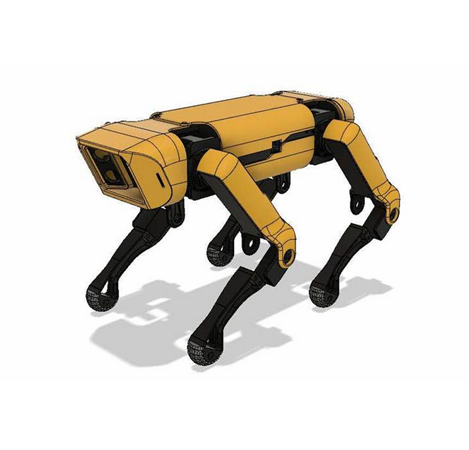
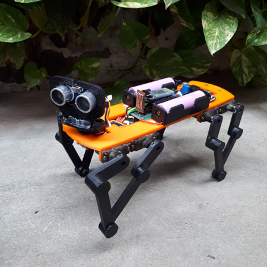

# 1. Herzlich Willkommen zu SwH
Herzlich Willkommen zu meinem ersten Post in meinem Sketching with Hardware Blog.
Ich bin Josef, Informatik Student an der Uni Ulm, mittlerweile im 2. Master Semester, und begeistert den Kurs Sketching with Hardware zu belegen.

## Überlegungen zu Projekten

Häufig enthalten Ideen zu Projekten zusätzlich zu einer Software Komponente einen Hardware Teil z.B. bei der Robotik, bei ferngesteuerten Autos, oder auch nur bei der Automatisierung der Kaffeemaschine, damit sie, nachdem der Wecker geklingelt hat, direkt frischen Kaffee aufbrüht, um das Aufstehen zu erleichtern.

Mir persönlich ist aufgefallen, dass viele Projekte, welche ich gerne umsetzen möchte, (ein weiteres Beispiel ist die automatische Regulierung meiner Heizkörper, allerdings sind diese Regler zu kostspielig) eine materielle Komponente besitzen. Dies kann der Fall sein, weil ein Controller sensorischen Input erhält und diesen verarbeitet oder weiterleitet, das ein Microcontoller auf Events reagieren muss oder das mit einer Fräse, dem Lasercutter oder dem 3D-Drucker einzelne Teile gefertigt werden müssen um eine mechanische oder visuelle Komponente zu erzeugen.

### Was ich mir von dem Kurs erhoffe

Da ich in den meisten hier beschriebenen Bereichen wenig bis keine Erfahrung habe und wenig Wissen besitze erhoffe ich mir von dem Kurs zu lernen mit diesen Bauteilen (Microcontroller, Sensoren etc.) und Werkzeugen (3D-Drucker, Lasercutter, Fräse etc.) umzugehen und zu lernen eben genau diese Hardware Komponenten bauen zu können, die für Projekte benötigt werden. Dies beinhaltet ebenso die Software kennenzulernen, welche verwendet wird um mit den Geräten arbeiten zu können.

## Projekt Robogepard

Falls ich alle Fähigkeiten für jegliches Projekt bereits besäße, habe ich mich entschieden einen Roboter zu bauen. Der Grund ist, dass ein funktionaler Roboter in meinen Augen die Grundlage für viele weitere Projekte bilden kann. Ebenso können Roboter viele verschiedene Aufgaben erledigen, welche von sehr funktionalen Dingen wie im Extremfall eine Bombe zu entschärfen bis hin zum Einsatz in Freizeit und sozialer Interaktion reichen (z.B. Tierroboter, welche in Wohnungen in denen keine Haustiere gehalten werden dürfen, zur sozialen Interaktion anregen).

Ich habe nach Anleitungen für verschiedene Roboter gesucht und bin schließlich auf diesen gestoßen.

Selbst wenn ich alle Fähigkeiten besäße müsste allerdings eine angemessene und ausführliche Dokumentation des Projekts vorhanden sein. Da dies für den *Roboterhund* nicht zutrifft habe ich mich daher für für den **[Robogepard](https://www.instructables.com/Baby-MIT-Cheetah-Robot-V2-Autonomous-and-RC/)** entschieden.

Dieser hat den Vorteil nicht zu groß zu sein, was ihn dienlich für weitere Projekte macht und er hat eine sehr ausführliche Dokumentation. Die Hauptbestandteile des Projekts sind das Arbeiten mit dem 3D-Drucker, sowie Löten und Montieren von Bauteilen.
Sowohl die Materialien, als auch die Konstruktion sind in der [Anleitung](https://www.instructables.com/Baby-MIT-Cheetah-Robot-V2-Autonomous-and-RC/) ausführlich beschrieben.
Weiter gibt es zur Steuerung Code, den man direkt auf den Arduino aufspielen kann und eine App, welche man sich direkt aus dem AppStore herunterladen kann, um den Roboter zu steuern.
